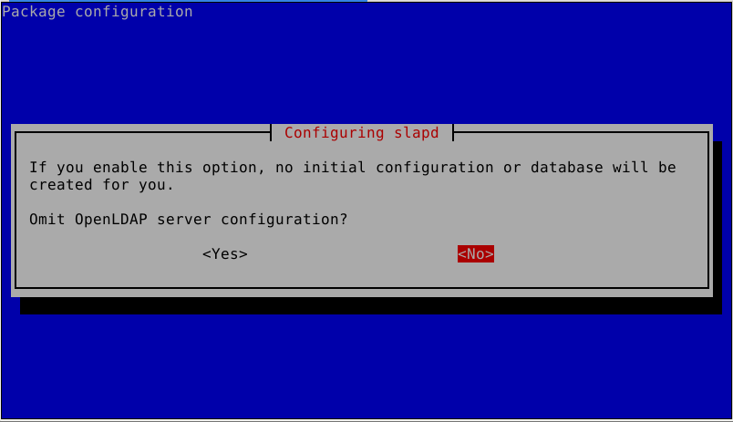
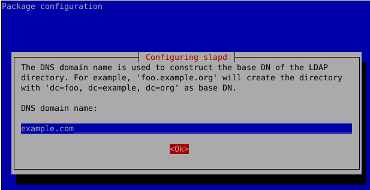
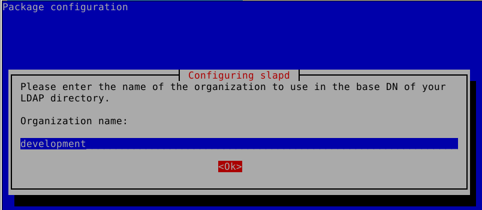
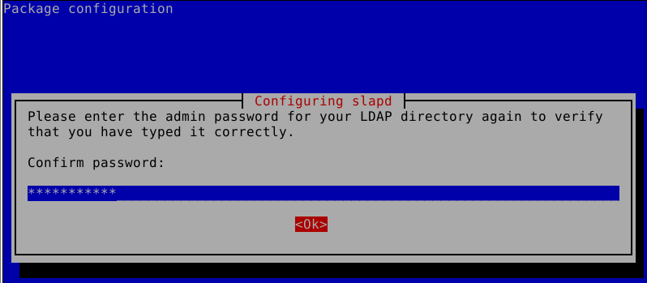
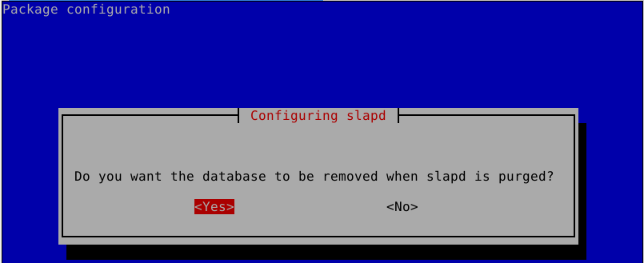
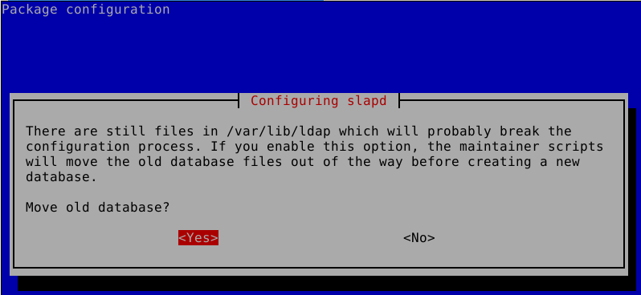

# LDAP

LDAP is used to centralice user accounts, information and configurations. It is multiplatform. More information in the following link [1]

## Prerequistes

### Debian 11 (Bullseye)
```bash
sudo apt update && sudo apt upgrade
sudo apt install slapd ldap-utils
```

Install slapd with any password, it will be change later on with "dpkg-reconfigure"

```bash
sudo dpkg-reconfigure slapd
```
Configure slapd by following "[Marc Venteo]'s video" or "Digital Ocean configuration"

1) 
2) 
3) 
4) 
5) 
6) 
7) 


## Common commands
### Adding Directory
Add directories defined in the .ldif files.
Like the sample files provided (ou.ldif, group.ldif, user.ldif)
```bash
sudo ldapadd -x -D cn=admin,dc=froylan,dc=ml -W -f ou.ldif
```

The password to be used for Ldap is the one created during the dpkg-reconfigure step

Use slapcat to verify the objectas that have been created

```bash
sudo slapcat
```

For user's passwords use (psswd=marvel)

```bash
sudo slappasswd
```


## Resources
* [Marc Venteo]
* [Digital ocean configuration]
* [Active Directory Explanation]

[1]: https://www.youtube.com/watch?v=zpXDMlXwW_I&list=PLw0uO9wnBmUmTOWbqvTudjJEjQFV5diTk&index=1
[Marc Venteo]: https://www.youtube.com/watch?v=6HkIDr3QF8Y&t=573s
[Digital ocean configuration]: https://www.digitalocean.com/community/tutorials/how-to-install-and-configure-openldap-and-phpldapadmin-on-ubuntu-16-04
[Active Directory Explanation]: https://www.youtube.com/watch?v=lFwek_OuYZ8
