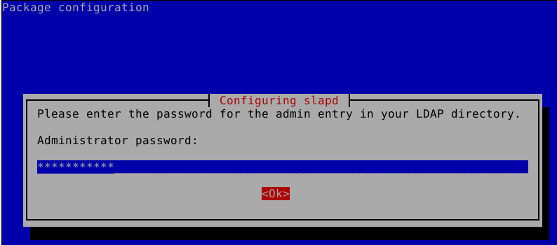

# LDAP

LDAP is used to centralice user accounts, information and configurations. It is multiplatform.\
More information in the following [link][ComandanteJ LDAP Explanation]\
This is guide will help you to set up LDAP asap. For a more complete server configuration use [Digital ocean configuration]'s guide

## Prerequistes
### Debian 11 (Bullseye)
```bash
sudo apt update && sudo apt upgrade
sudo apt install slapd ldap-utils
```
Install slapd with any password, it will be change later on with "dpkg-reconfigure"


## Configuration
```bash
sudo dpkg-reconfigure slapd
```
Configure slapd by following "[Marc Venteo's LDAP]'s video" or "[Digital Ocean configuration]". A brief summary is described next:

1. Omit LDAP Server configuration\
   
1. DNS Domain Name\
   
1. Organization Name\
   
1. Administrator password\
   
1. Confirm administrator password\
   
1. Remove database\
   
1. Move old database\
   


## Common commands
Some sample files have been provided in the "samples" folder to add "Organizational Units", "Groups" and "Users"

### Adding Directories

#### Adding Organizational Units
Use the following command to add the organizational unit defined in samples/ou.ldif
```bash
sudo ldapadd -x -D cn=admin,dc=example,dc=com -W -f samples/ou.ldif
```
The dn and ou keys should be modified to appropriate values

#### Adding Groups
Use the following command to add the groups defined in samples/group.ldif
```bash
sudo ldapadd -x -D cn=admin,dc=example,dc=com -W -f samples/group.ldif
```
The dn, gidNumber and cn keys should be modified to appropriate values

#### Adding Users
Use the following command to add the users defined in samples/user.ldif
```bash
sudo ldapadd -x -D cn=admin,dc=example,dc=com -W -f samples/user.ldif
```
The dn, cn, uid, uidNumber, gidNumber, homeDirectory, userPassword, sn, mail and givenName keys should be modified to appropriate values

The userPassword encrypted value should be defined using "slappasswd". In the samples/user.ldif "marvel" was used as the password
```bash
sudo slappasswd
```

#### Verify objects
Use slapcat to verify the objects that have been created

```bash
sudo slapcat
```

## Notes
All of the resources proviced below are good guides for learning Ldap! I would start watching and reading them in the order they are provided


## Resources
* [ComandanteJ's playlist]
* [Marc Venteo's LDAP]
* [Digital ocean configuration]
* [Eli the Computer Guy's AD explanation]
* [Official OpenLdap]

[Marc Venteo's LDAP]: https://www.youtube.com/watch?v=6HkIDr3QF8Y
[Digital ocean configuration]: https://www.digitalocean.com/community/tutorials/how-to-install-and-configure-openldap-and-phpldapadmin-on-ubuntu-16-04
[Eli the Computer Guy's AD explanation]: https://www.youtube.com/watch?v=lFwek_OuYZ8
[ComandanteJ's playlist]: https://www.youtube.com/playlist?list=PLw0uO9wnBmUmTOWbqvTudjJEjQFV5diTk
[ComandanteJ LDAP explanation]: https://www.youtube.com/watch?v=zpXDMlXwW_I&list=PLw0uO9wnBmUmTOWbqvTudjJEjQFV5diTk&index=1
[Official OpenLdap]: https://www.openldap.org
