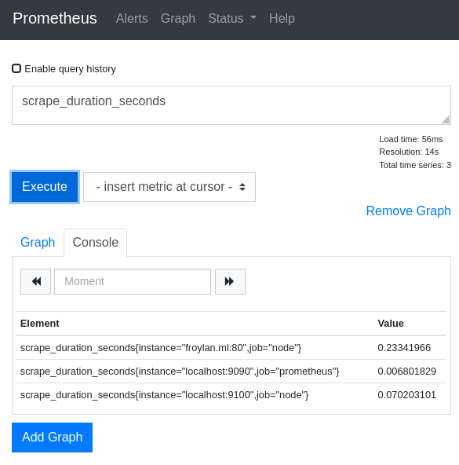

# Prometheus alert and monitoring

## References
1. [Prometheus][prometheus]
1. [Sbcode][sbcode]

## Lessons

### 9 PromQL Example Queries

In the Graph Section of Prometheus GUI make a call to a query, for example:

[prometheus]: https://prometheus.io
[sbcode]: https://sbcode.net/prometheus
