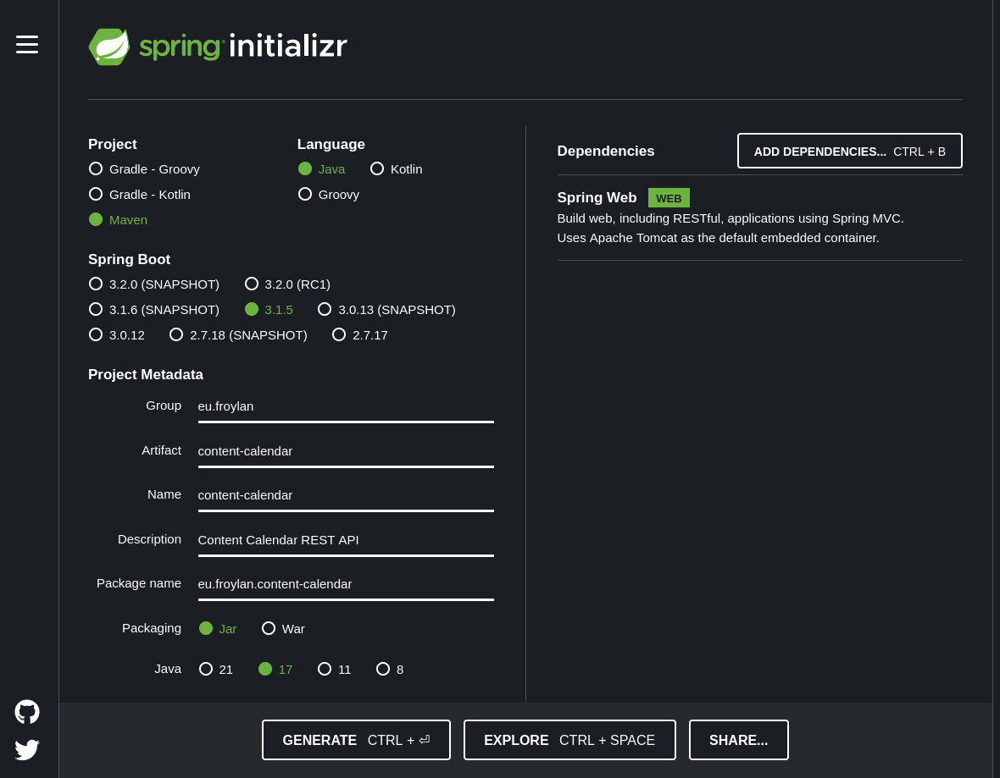

# Start Project

## Prerequisites
1. Install Java JDK. Use the [Java setup](/languages/java/setup.md) guide
1. Install Maven. Use the [Maven setup](/languajes/java/maven_setup.md) guide

## Start project
Go to [https://start.spring.io](https://start.spring.io) and fill in the details like follows

Click on Generate to Download the Project's boilerplate template

